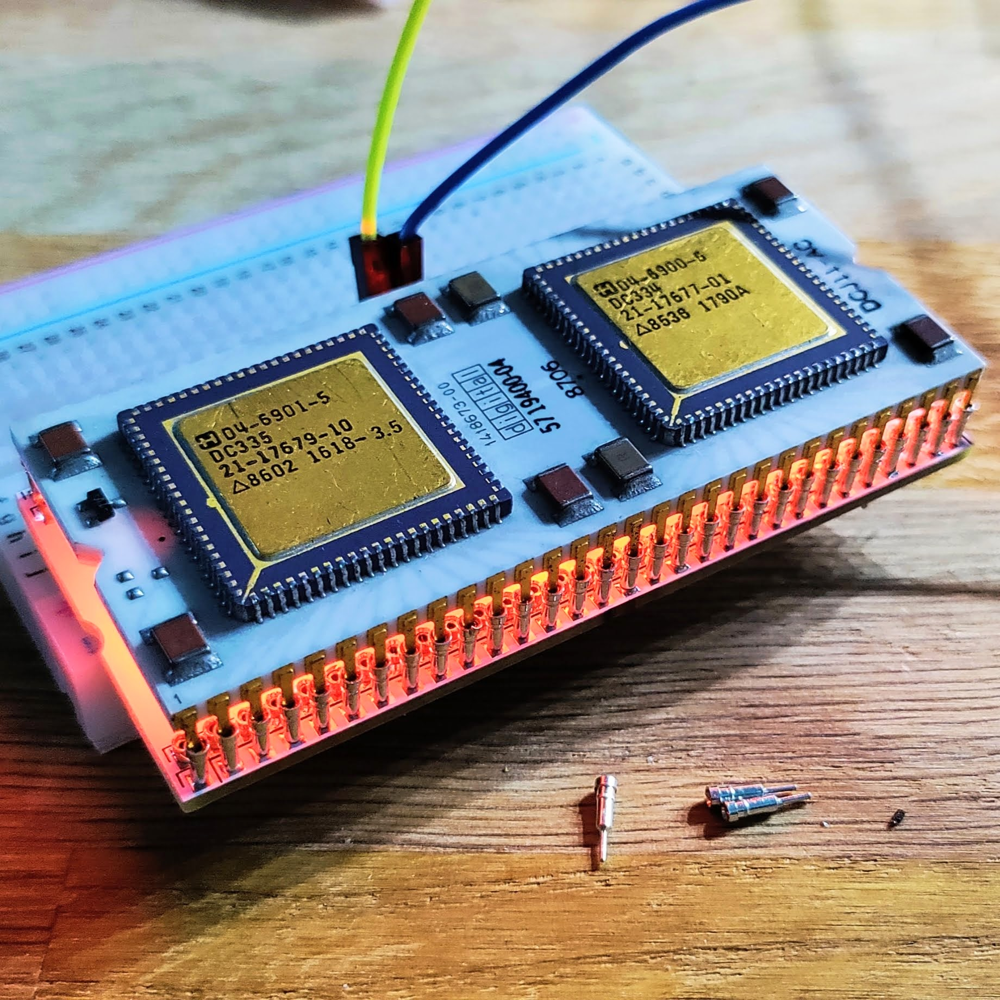
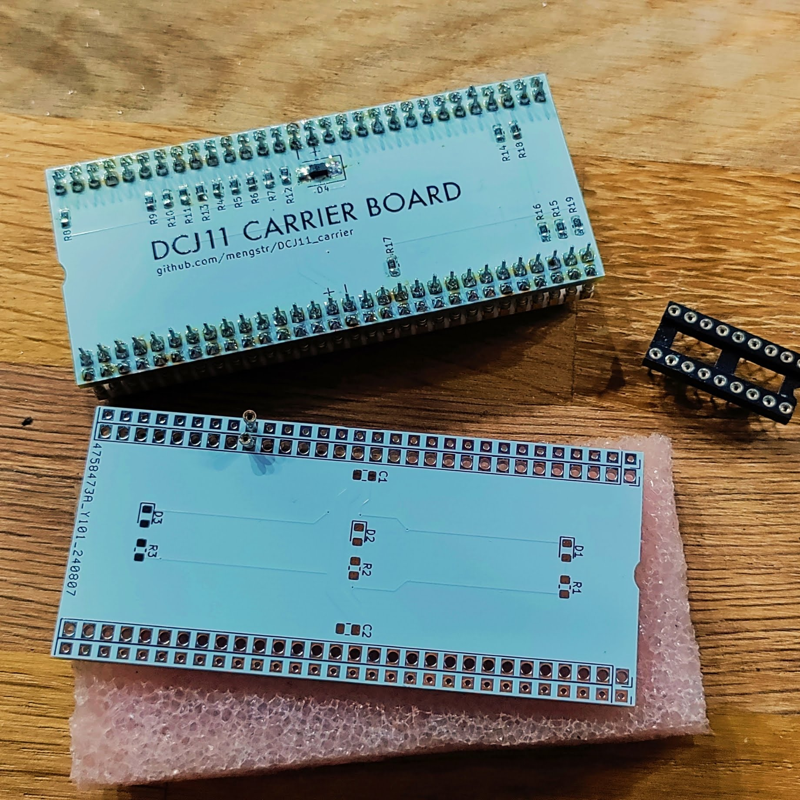
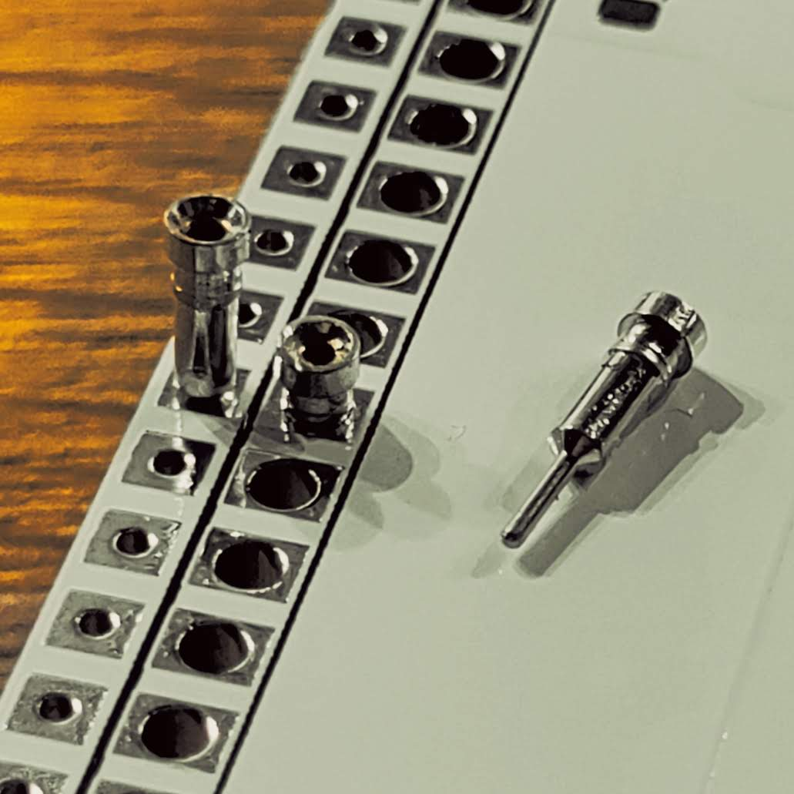

# DCJ11_carrier

To protect the sensitive pins on the DCJ11 CPU, I designed a small carrier board to keep it safe.

I added a few extras to the board, like reverse polarity protection—just a simple reverse diode that shorts the power if applied incorrectly. (I know it really should have been a proper P-MOS instead, but hey, it’s better than nothing.) 

I also included pull-ups and pull-downs on the inputs since many of them won’t be in use for simple applications. This keeps them stable at the carrier level, so there’s no need to add jumpers externally. After the images here is a table with the pinout indicating which pins that have the pulls on them.

There are also two extra capacitor footprints on the top side of the carrier if needed, though the DCJ11 itself seems to have plenty of local capacitance. Just for fun, I added footprints for a few LEDs and resistors, hoping that the ceramic package of the DCJ11 would let some light through and create a cool glowing effect—but no joy. The ceramic is completely opaque.

The PCB is designed to use turned IC socket contacts. The row with smaller holes is for the DCJ11 itself, lifting it up a few millimeters above the PCB. The larger holes allow the contacts to drop down fully to their flanges, making them protrude as much as possible below the board so the carrier can later be inserted into the user motherboard.

### DCJ11 plugged into the PCB and the LEDs turned on.

### Front- and backside of the PCB

### How the turned pin headers are mounted

## Pinout of the DCJ11

| Pin# | Direction | Pull   | Name    | Description          |
| --- | --- | -- | ------- | -------------------- |
| 1   | in  | pu | nTEST1  | Test input           |
| 2   | out |    | AIO 0   | Address I/O 0        |
| 3   | out |    | AIO 1   | Address I/O 1        |
| 4   | out |    | AIO 2   | Address I/O 2        |
| 5   | out |    | AIO 3   | Address I/O 3        |
| 6   | in  | pu | nPWRF   | Power fail           |
| 7   | in  | pu | nFPE    | Floating-point error |
| 8   | in  | pu | nEVENT  | Event interrupt      |
| 9   | in  | pd | HALT    | Halt processor       |
| 10  | in  | pd | IRQ0    | Interrupt request 0  |
| 11  | in  | pd | IRQ1    | Interrupt request 1  |
| 12  | in  | pd | IRQ2    | Interrupt request 2  |
| 13  | in  | pd | IRQ3    | Interrupt request 3  |
| 14  | in  | pu | nPARITY | Parity check         |
| 15  | -   |    | GND     | Ground (0V)          |
| 16  | -   |    | VCC     | Power (5V)           |
| 17  | out |    | BS 0    | Bus strobe 0         |
| 18  | out |    | BS 1    | Bus strobe 1         |
| 19  | out |    | nMAP    | Memory map control   |
| 20  | i/o |    | nABORT  | Abort cycle          |
| 21  | out |    | DAL21   | Data/address line 21 |
| 22  | out |    | DAL20   | Data/address line 20 |
| 23  | out |    | DAL19   | Data/address line 19 |
| 24  | out |    | DAL18   | Data/address line 18 |
| 25  | out |    | DAL17   | Data/address line 17 |
| 26  | out |    | DAL16   | Data/address line 16 |
| 27  | in  | pu | nDMR    | DMA request          |
| 28  | in  | pu | nMISS   | Cache miss           |
| 29  | out |    | nPRDC   | Predict control      |
| 30  | -   |    | N.C.    | Unused pin           |
| 31  | in  | pu | nTEST2  | Test output          |
| 32  | in  | pu | nCONT   | Continue signal      |
| 33  | in  | pu | nINIT   | Initialize           |
| 34  | out |    | CLK2    | Clock 2              |
| 35  | i/o |    | CLK     | Clock                |
| 36  | in  |    | XTALHI  | Crystal input        |
| 37  | out |    | XTALLO  | Crystal output       |
| 38  | out |    | nSCTL   | Strobe control       |
| 39  | out |    | nSTRB   | Strobe signal        |
| 40  | out |    | nALE    | Address latch enable |
| 41  | out |    | nBUFCTL | Buffer control       |
| 42  | in  | pu | DV      | Device vector        |
| 43  | i/o |    | DAL5    | Data/address line 5  |
| 44  | i/o |    | DAL4    | Data/address line 4  |
| 45  | -   |    | GND     | Ground (0V)          |
| 46  | -   |    | VCC     | Power (5V)           |
| 47  | i/o |    | DAL3    | Data/address line 3  |
| 48  | i/o |    | DAL2    | Data/address line 2  |
| 49  | i/o |    | DAL1    | Data/address line 1  |
| 50  | i/o |    | DAL15   | Data/address line 15 |
| 51  | i/o |    | DAL14   | Data/address line 14 |
| 52  | i/o |    | DAL13   | Data/address line 13 |
| 53  | i/o |    | DAL12   | Data/address line 12 |
| 54  | i/o |    | DAL11   | Data/address line 11 |
| 55  | i/o |    | DAL10   | Data/address line 10 |
| 56  | i/o |    | DAL9    | Data/address line 9  |
| 57  | i/o |    | DAL0    | Data/address line 0  |
| 58  | i/o |    | DAL8    | Data/address line 8  |
| 59  | i/o |    | DAL7    | Data/address line 7  |
| 60  | i/o |    | DAL6    | Data/address line 6  |
 
    
      
